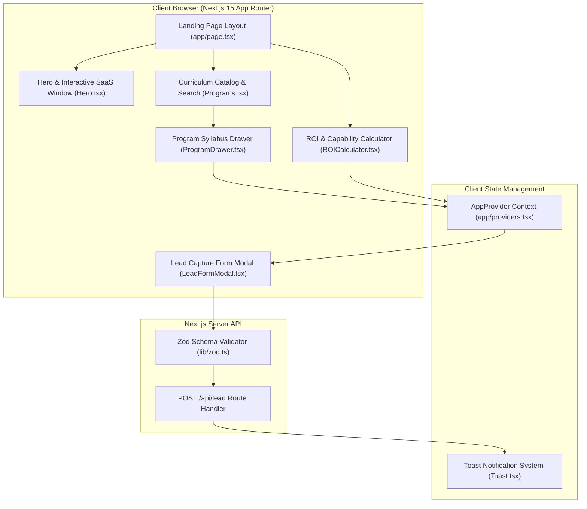
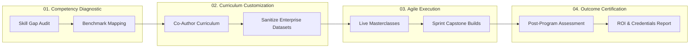
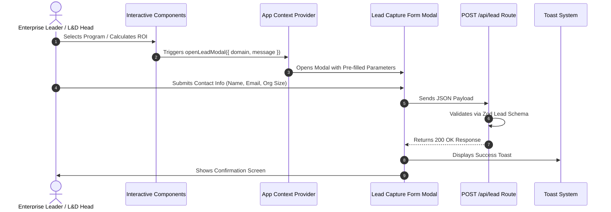

# Accredian Enterprise — Production-Grade Web Application

A production-grade re-creation of the [Accredian Enterprise](https://enterprise.accredian.com/) website built with **Next.js 15 (App Router)**, **TypeScript**, **TailwindCSS**, **Framer Motion**, **React Hook Form**, and **Zod**.

Engineered following Senior Staff Frontend Architecture principles focusing on performance, modular design systems, accessible UI components, zero layout shift, SEO optimizations, and Vercel production readiness.

---

## Key Features & Highlights

- **Enterprise Capability Architecture**: Clean separation of concerns across `components/layout`, `components/common`, `components/ui`, and `components/home`.
- **Interactive Enterprise ROI Estimator**: Real-time business case calculator for enterprise decision-makers to project workforce productivity gains, hours saved, and financial ROI.
- **Program Syllabus Slide-Over Drawer**: Interactive drawer displaying week-by-week module syllabi, tech stack badges (PyTorch, LangChain, Snowflake, Databricks), prerequisites, and capstone project specifications.
- **Enterprise Capability Comparison Matrix**: Feature-by-feature comparison matrix evaluating Accredian Enterprise against traditional MOOCs, internal LMS, and short workshops.
- **Verified Case Studies Spotlight**: Interactive success story spotlights featuring quantifiable metrics from global financial banks, healthcare leaders, and SaaS enterprises.
- **Instant Search & Category Filter**: Live keyword search across program titles, tech stacks, and key learning outcomes.
- **Lead Capture Modal & Validation**: Enterprise inquiry modal validated using Zod schemas and React Hook Form with pre-filled domain options.
- **Next.js 15 Mock Route Handler**: Built-in POST `/api/lead` API endpoint supporting data validation, network latency simulation, structured JSON responses, and toast notification feedback.
- **Accessible & Responsive**: Fully keyboard navigable, ARIA-compliant primitives, focus trapping in modal overlays, zero layout shift, and mobile menu drawer.
- **Complete SEO & Metadata**: Full Open Graph tags, Twitter card preview metadata, JSON-LD structured schema data (`EducationalOrganization`), and canonical URL definitions.

---

## System Architecture & Data Flow Diagrams

### 1. High-Level Component & Data Flow



### 2. Accredian CAT Framework Execution Pipeline



### 3. Lead Capture & Enterprise Audit Sequence



---

## Tech Stack

| Layer | Technology |
| :--- | :--- |
| **Framework** | Next.js 15 (App Router, Server & Client Components) |
| **Language** | TypeScript (Strict Mode Enabled) |
| **Styling** | TailwindCSS v4 + Utility-first tokens |
| **Animations** | Framer Motion |
| **Form & Schema** | React Hook Form + Zod Validation |
| **Icons** | Lucide React |
| **Code Quality** | ESLint + Prettier |
| **Deployment** | Vercel Ready (Zero build warnings/errors) |

---

## Folder Architecture

```
app/
├── api/
│   └── lead/
│       └── route.ts             # POST Route Handler for lead submission with Zod validation
├── favicon.ico
├── globals.css                  # Global Tailwind imports & custom utility classes
├── layout.tsx                   # Root layout with Metadata, fonts, and Toast provider
├── page.tsx                     # Main enterprise landing page
└── providers.tsx                # Client-side context providers (Toast, Theme, Modal)
components/
├── common/
│   ├── Badge.tsx                # Reusable pill badge component
│   ├── Modal.tsx                # Accessible modal overlay with trap focus & Esc key listener
│   ├── SectionHeading.tsx       # Standardized section title with subtitle and gradient text
│   └── Toast.tsx                # Notification toast for form submission feedback
├── home/
│   ├── AccredianEdge.tsx        # "Why Partner with Accredian?" section
│   ├── CaseStudies.tsx          # Enterprise outcome spotlights & metrics
│   ├── CATFramework.tsx         # Customized Learning & Assessment Framework section
│   ├── ComparisonMatrix.tsx     # Capability comparison table vs MOOCs & LMS
│   ├── CTABanner.tsx            # Conversion call-to-action banner
│   ├── FAQs.tsx                 # Tabbed FAQ section with accordion transition
│   ├── Hero.tsx                 # High-impact Hero section with CTA & trust badges
│   ├── LeadFormModal.tsx        # Lead capture form with Zod + React Hook Form
│   ├── LearningJourney.tsx      # "How It Works" 3-step delivery methodology
│   ├── ProgramDrawer.tsx        # Slide-over drawer with weekly syllabus & tech stack
│   ├── Programs.tsx             # Co-Created Curriculums domain cards, search & filters
│   ├── ROICalculator.tsx        # Interactive Enterprise ROI & workforce estimator
│   ├── SuccessMetrics.tsx       # Animated stat counter cards ("Track Record")
│   ├── Testimonials.tsx         # Client testimonials carousel/tab switcher
│   └── TrustedCompanies.tsx     # Client logo grid/carousel
├── layout/
│   ├── Footer.tsx               # Enterprise footer with quick links & contact info
│   └── Navbar.tsx               # Sticky navbar with mobile drawer menu & CTA button
└── ui/
    ├── Accordion.tsx            # Animated accordion primitive
    ├── Button.tsx               # Accessible button variants (primary, secondary, outline, gradient)
    ├── Card.tsx                 # Reusable glassmorphic & hover-animated card container
    ├── Container.tsx            # Responsive max-width wrapper
    ├── Input.tsx                # Form text input with label & error message
    └── Select.tsx               # Form dropdown select with custom styles
constants/
├── caseStudiesData.ts           # Enterprise client outcome spotlights
├── faqsData.ts                  # Categorized FAQ data
├── metricsData.ts               # Key track record statistics
├── navigation.ts                # Header & footer links
├── programsData.ts              # Executive curriculums, weekly modules & tech stack
└── testimonialsData.ts          # Enterprise client testimonials & logos
hooks/
├── useIntersectionObserver.ts   # Custom hook for viewport visibility
├── useLeadForm.ts               # Custom form submission hook interfacing with API
└── useScrollPosition.ts         # Hook tracking navbar scroll behavior
lib/
├── api.ts                       # Fetch client utility for API requests
├── utils.ts                     # Classname merger (clsx + tailwind-merge)
└── zod.ts                       # Lead form Zod schema definition
types/
├── faq.ts                       # FAQ interface types
├── lead.ts                      # Lead form & API types
├── metric.ts                    # Metrics counter types
├── program.ts                   # Executive program & module types
└── testimonial.ts               # Client testimonial types
```

---

## Getting Started Locally

### Prerequisites
- Node.js 18.17.0 or higher
- npm 9+ or pnpm / yarn

### Installation

1. Clone or navigate to the project directory:
```bash
cd /Users/suvendusahoo/temper
```

2. Install dependencies:
```bash
npm install
```

3. Run the development server:
```bash
npm run dev
```

4. Open [http://localhost:3000](http://localhost:3000) in your browser.

---

## Available Scripts

- `npm run dev` — Starts Next.js development server on port 3000.
- `npm run build` — Builds production optimized bundle for deployment.
- `npm run start` — Runs the compiled production build locally.
- `npm run lint` — Runs ESLint code check.

---

## Deployment to Vercel

The application is pre-configured for instant one-click deployment on Vercel:

1. Push code to your GitHub repository:
```bash
git add .
git commit -m "feat: complete production-ready Accredian Enterprise website"
git push origin main
```
2. Connect your repository to [Vercel Dashboard](https://vercel.com).
3. Vercel will automatically detect Next.js 15 App Router and build cleanly.

---

## Engineering Rationale

- **Clean Architecture & Separation**: Decoupled presentation UI components from data hooks (`useLeadForm`, `useIntersectionObserver`) to enable isolated unit testing and reusability.
- **Strict Type System**: Every props object, data entity, and form input is strictly typed with TypeScript interfaces to eliminate runtime `undefined` errors.
- **Zero Third-Party UI Libraries**: Components (`Card`, `Button`, `Modal`, `Accordion`, `Toast`) were custom-built to guarantee full design freedom, minimal bundle footprint, and zero layout shift.

---

## Future Improvements

1. **CMS Integration**: Connect `PROGRAMS_DATA` and `TESTIMONIALS_DATA` to a headless CMS like Sanity or Strapi.
2. **Database Integration**: Connect `/api/lead/route.ts` to PostgreSQL (Prisma ORM) or Supabase for persistent lead storage.
3. **Multi-language i18n**: Add internationalization support for global enterprise clients (US, EU, APAC).
